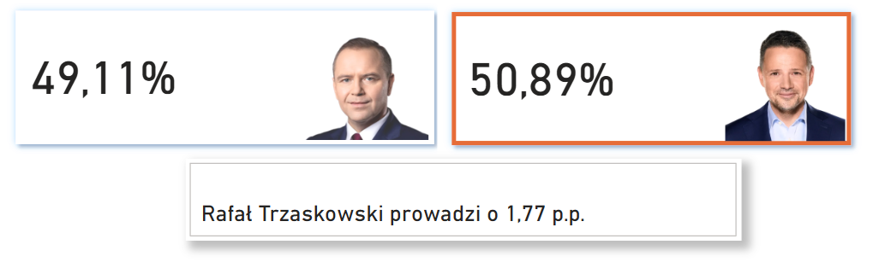
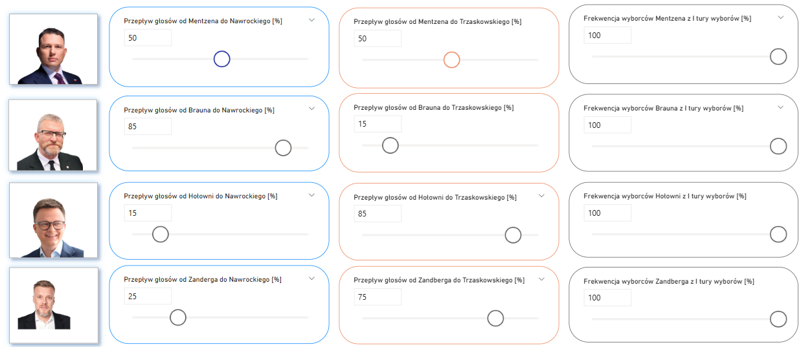
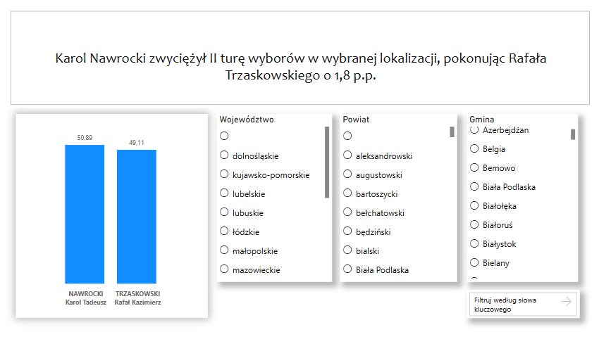

# Symulacja II tury wyborów prezydenckich 2025

Link do pobrania projektu z OneDrive: https://1drv.ms/u/c/5acb985c73202279/EVlbtFpIWMBPoOeYEk7Jss8Bmb_sUf9J28Iod-6o8Xvnxg?e=uspFpn

Link do danych źródłowych ze strony PKW: https://wybory.gov.pl/prezydent2025/data/csv/wyniki_gl_na_kandydatow_po_gminach_csv.1747645331.zip

📊 Ten projekt to mój autorski dashboard stworzony w Microsoft Power BI Desktop, który umożliwia symulację wyników II tury wyborów prezydenckich na podstawie rzeczywistych danych z I tury oraz założonych przepływów głosów między kandydatami.

## Co znajdziesz w tym repozytorium?  
- 📁 Link do pliku projektu Power BI (`.pbix`) z modelem danych i dashboardem  
- 📊 Link do danych źródłowych (wyniki I tury z PKW w formacie „one big table”)  
- 🧮 Przykładowe miary DAX do obliczania prognozowanych wyników  
- 📖 Instrukcje dotyczące wykorzystania i możliwości konfiguracji symulacji (frekwencja, przepływy elektoratów, nowi wyborcy)  
- 🖼️ Zrzuty ekranu pokazujące interfejs i przykładowe wizualizacje  

## Funkcjonalności  
- 📈 Modelowanie wyników II tury w oparciu o dane z I tury  
- 🔄 Możliwość modyfikacji przepływów wyborców między kandydatami  
- ✅ Uwzględnienie frekwencji wśród elektoratów  
- ➕ Dodanie nowych wyborców i ich rozkład głosów  
- 🎛️ Interaktywne wizualizacje pozwalające eksperymentować z różnymi scenariuszami
- 📈 Wyświetlenie wyników II tury wyborów z możliwością filtrowania po województwach, powiatach, gminach

## 🛠️ Co do naprawy przede mną? 
- ⚠️ Można ustawić 100% przepływu głosów dla obu kandydatów jednocześnie, co nie ma sensu w rzeczywistych scenariuszach.  

## Jak korzystać?  
1. 📂 Otwórz plik `.pbix` w Power BI Desktop  
2. 🎛️ Przeglądaj dashboard i eksperymentuj z ustawieniami przepływów oraz frekwencji  
3. 📊 Analizuj symulowane wyniki i porównuj z rzeczywistymi danymi

## Krótki opis stworzonego dashboardu

Na górze dashboradu znajdują się dwie karty, które wyświetlają aktualnie obliczony wynik każdego z kandydatów.
Obramowanie karty kandydata, który ma większy wynik ma odpowiednio niebieski lub pomarańczowy kolor.
Poniżej znajduje sie ramka, w której wyświetla sie informacja o przewadze danego kandydata.

Dla każdego z kandydatów, którzy brali udział w I turze wyborów utworzyłem fragmentatory, w których można
określić, jaki procent głosów danego kandydata z I tury ma przepłynąć do Karola Nawrockiego, a jaki do
Rafała Trzaskowskiego. Przesunięcie suwaka powoduje automatyczne przeliczenie głosów i wyniku procentowego
kandydatów za pomocą utworzonych miar DAX.

Na samym dole dashboardu znajduje się możliwość uwzględnienia głosów nowych wyborców, którzy nie brali udziału
w I turze wyborów wraz z ustawieniem, jaki procent tych głosów przepłynie do jednego, a jaki - do drugiego kandydata.

Na karcie "Wyniki II tura" znajduje się wykres słupkowy przedstawiający wyniki procentowe kandydatów w zależności od wybranej lokalizacji.
Dostępne są fragmentatory umożliwiające filtrowanie po województwie, rejonie oraz miejscowości. Możliwe jest wybranie kilku opcji we fragmentatorze
jednocześnie (należy zaznaczać opcje z wciśniętym klawiszem CTRL). W zależności od wybranych filtrów generowany jest dynamicznie za pomocą miary DAX
opis mówiący o tym, który kandydat zwyciężył w danej lokalizacji oraz podana jest jego przewaga procentowa.

## Historia zmian
21-30.05.2025 r. - utworzenie dashboardu "Predykcja wyników"

02.06.2025 r. - utworzenie tabeli "Fakt_Glosy_II_Tura" na podstawie oficjalnych wyników PKW, rozpoczęcie pracy nad dashboardem "Wyniki II tury",
który będzie prezentować dane dotyczące wyników II tury wyborów prezydenckich

03.06.2025 r. - rozwiązanie problemu z komisjami z zagranicy, które były umieszczone jako gminy bez przypisanego odpowiedniego
identyfikatora, przez co nie można było utworzyć relacji między tabelami "Fakt_Glosy_II_Tura" a "Wymiar_Komisje". 
Dodanie na dashboardzie "Wyniki II tury" wykresu słupkowego przedstawiającego wyniki II tury. 
Dodanie filtrowania wyników po województwach, powiatach, gminach. 

04.06.2025 r. - dodanie dynamicznego opisu na dashboardzie z wynikami II tury, który opisuje, który kandydat wygrał
w danej lokalizacji wraz z jego przewagą procentową

------------------------------------------------------------------------------------------------------------------------
# Simulation of the 2025 Presidential Election Second Round

Download link to the project from OneDrive: https://1drv.ms/u/c/5acb985c73202279/EVlbtFpIWMBPoOeYEk7Jss8Bmb_sUf9J28Iod-6o8Xvnxg?e=uspFpn

Link to the source data from the PKW website:
https://wybory.gov.pl/prezydent2025/data/csv/wyniki_gl_na_kandydatow_po_gminach_csv.1747645331.zip

📊 This project is my original dashboard created in Microsoft Power BI Desktop, enabling simulation of the second round of presidential election results based on real data from the first round and assumed vote flows between candidates.

## What you’ll find in this repository:
📁 Link to the Power BI project file (.pbix) containing the data model and dashboard
📊 Link to the source data (1st round election results from PKW in a “one big table” format)
🧮 Sample DAX measures for calculating projected results
📖 Instructions on usage and configuration options for the simulation (turnout, voter flows, new voters)
🖼️ Screenshots showcasing the interface and example visualizations

## Features  
- 📈 Modeling second round results based on first round data  
- 🔄 Ability to modify voter flows between candidates  
- ✅ Inclusion of turnout among voter groups  
- ➕ Adding new voters and their vote distribution  
- 🎛️ Interactive visualizations to experiment with different scenarios  

## 🛠️ Known issues to fix  
- ⚠️ It’s possible to set 100% vote flow for both candidates simultaneously, which doesn’t make sense in real scenarios.  
- 🔧 The new voters slider (0–10 million) is inefficient and hasn’t been improved yet.  

## How to use?  
1. 📂 Open the `.pbix` file in Power BI Desktop  
2. 🎛️ Browse the dashboard and experiment with vote flow and turnout settings  
3. 📊 Analyze simulated results and compare with actual data  

## Brief description of the created dashboard
At the top of the dashboard, there are two cards displaying the currently calculated result for each candidate.
The border of the card for the candidate with the higher result is colored blue or orange accordingly.
Below, there is a box showing the lead margin of the leading candidate.

For each candidate who participated in the first round, I created slicers where you can specify what percentage of that candidate’s votes from round one will flow to Karol Nawrocki and what percentage to Rafał Trzaskowski.
Moving the slider automatically recalculates the vote counts and the candidates’ percentage results using created DAX measures.

At the bottom of the dashboard, there is an option to include votes from new voters who did not participate in the first round, along with settings for what percentage of these votes flows to each candidate.

## Changes history
May 21–30, 2025 – Created the "Prediction of Results" dashboard

June 2, 2025 – Created the "Fact_Votes_Second_Round" table based on official PKW results; began work on the "Second Round Results" dashboard

June 3, 2025 – Resolved the issue with foreign commissions that were listed as municipalities without an assigned identifier, which prevented establishing a relationship between the "Fakt_Glosy_II_Tura" and "Wymiar_Komisje" tables.
Added a bar chart to the "Second Round Results" dashboard showing the results of the second round.
Implemented filtering of results by voivodeship, county, and municipality.

June 4, 2025 – Added a dynamic description on the second round results dashboard, indicating which candidate won in a given location along with their percentage lead.

